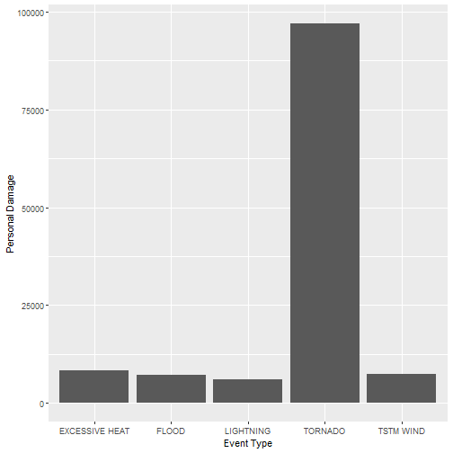
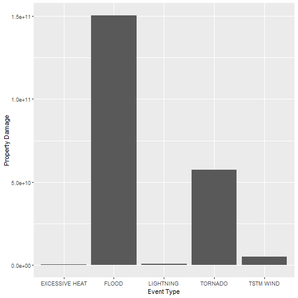

# Storm Data Documentation

## Synopsis
The Storm Data Documentation shows that storms and other severe weather events could cause both public health and economic problem to communities.

With the NOAA storem data provided by the U.S. National Oceanic and Atmospheric Administration’s storm database, we will perform analysis and answer some basic question about sever weather events. 

- Across the United States, which types of events (as indicated in the EVTYPE variable) are most harmful with respect to population health?

- Across the United States, which types of events have the greatest economic consequences?

## Data Processing

Libraries

```r
library(plyr)
library(ggplot2)
```

Loading Data

```r
setwd("C:/Users/dongj/Desktop/R_data_Desk/Reproducible_Research")
if(!file.exists("./Project_2/repdata_data_StormData.csv.bz2")){
  URL <- "http://d396qusza40orc.cloudfront.net/repdata%2Fdata%2FStormData.csv.bz2"
  download.file(URL, destfile="./Project_2/repdata_data_StormData.csv.bz2")
}

data <- read.csv("./Project_2/repdata_data_StormData.csv.bz2")
colnames(data)
```

```
##  [1] "STATE__"    "BGN_DATE"   "BGN_TIME"   "TIME_ZONE"  "COUNTY"    
##  [6] "COUNTYNAME" "STATE"      "EVTYPE"     "BGN_RANGE"  "BGN_AZI"   
## [11] "BGN_LOCATI" "END_DATE"   "END_TIME"   "COUNTY_END" "COUNTYENDN"
## [16] "END_RANGE"  "END_AZI"    "END_LOCATI" "LENGTH"     "WIDTH"     
## [21] "F"          "MAG"        "FATALITIES" "INJURIES"   "PROPDMG"   
## [26] "PROPDMGEXP" "CROPDMG"    "CROPDMGEXP" "WFO"        "STATEOFFIC"
## [31] "ZONENAMES"  "LATITUDE"   "LONGITUDE"  "LATITUDE_E" "LONGITUDE_"
## [36] "REMARKS"    "REFNUM"
```

```r
dim(data)
```

```
## [1] 902297     37
```


Cleaning/Analyzing Data

```r
data <- data[ , c("EVTYPE", "BGN_DATE", "FATALITIES", "INJURIES", "PROPDMG", "PROPDMGEXP", "CROPDMG", "CROPDMGEXP")]
str(data)
```

```
## 'data.frame':	902297 obs. of  8 variables:
##  $ EVTYPE    : chr  "TORNADO" "TORNADO" "TORNADO" "TORNADO" ...
##  $ BGN_DATE  : chr  "4/18/1950 0:00:00" "4/18/1950 0:00:00" "2/20/1951 0:00:00" "6/8/1951 0:00:00" ...
##  $ FATALITIES: num  0 0 0 0 0 0 0 0 1 0 ...
##  $ INJURIES  : num  15 0 2 2 2 6 1 0 14 0 ...
##  $ PROPDMG   : num  25 2.5 25 2.5 2.5 2.5 2.5 2.5 25 25 ...
##  $ PROPDMGEXP: chr  "K" "K" "K" "K" ...
##  $ CROPDMG   : num  0 0 0 0 0 0 0 0 0 0 ...
##  $ CROPDMGEXP: chr  "" "" "" "" ...
```

- EVTYPE: Weather event type
- BGN_DATE: Begining date of event
- FATALITIES: Number of human fatalities
- INJURIES: Number of human injures
- PROPMDG: a measure of property damage
- PROPDMGEXP: dollar value for property damage
- CROPMDG: a measure of crope damage
- CROPDMGEXP: dollar value of crope damage


Fixing Data Type 


```r
data$BGN_DATE <- as.POSIXct(data$BGN_DATE,format="%m/%d/%Y %H:%M:%S")
```


Converting Values

```r
unique(data$PROPDMGEXP)
```

```
##  [1] "K" "M" ""  "B" "m" "+" "0" "5" "6" "?" "4" "2" "3" "h" "7" "H" "-"
## [18] "1" "8"
```

```r
unique(data$CROPDMGEXP)
```

```
## [1] ""  "M" "K" "m" "B" "?" "0" "k" "2"
```

Using mapvalues function to replace values to number

```r
propdamage <- mapvalues(data$PROPDMGEXP,
c("K","M","", "B","m","+","0","5","6","?","4","2","3","h","7","H","-","1","8"), 
c(1e3,1e6, 1, 1e9,1e6,  1,  1,1e5,1e6,  1,1e4,1e2,1e3,  1,1e7,1e2,  1, 10,1e8))

cropdamage <- mapvalues(data$CROPDMGEXP,
c("","M","K","m","B","?","0","k","2"),
c( 1,1e6,1e3,1e6,1e9,1,1,1e3,1e2))

data$totalprop <- as.numeric(propdamage) * data$PROPDMG
data$totalcrop <- as.numeric(cropdamage) * data$CROPDMG

data$totaldamage <- data$totalprop + data$totalcrop
```

Calculating Total Fatalities and Injuries(Personal Damage)

```r
summary <- ddply(data,.(EVTYPE), summarize, propdamage = sum(totaldamage), injuries= sum(INJURIES), fatalities = sum(FATALITIES), persdamage = sum(INJURIES)+sum(FATALITIES))


summary <- summary[order(-summary$persdamage),]
summary <- summary[1:5,]
head(summary)
```

```
##             EVTYPE   propdamage injuries fatalities persdamage
## 834        TORNADO  57362333947    91346       5633      96979
## 130 EXCESSIVE HEAT    500155700     6525       1903       8428
## 856      TSTM WIND   5038935845     6957        504       7461
## 170          FLOOD 150319678257     6789        470       7259
## 464      LIGHTNING    942471520     5230        816       6046
```

Calculating Property damage (Economic consequence)

```r
summary <- summary[order(-summary$propdamage),]
summary <- summary[1:5,]
head(summary)
```

```
##             EVTYPE   propdamage injuries fatalities persdamage
## 170          FLOOD 150319678257     6789        470       7259
## 834        TORNADO  57362333947    91346       5633      96979
## 856      TSTM WIND   5038935845     6957        504       7461
## 464      LIGHTNING    942471520     5230        816       6046
## 130 EXCESSIVE HEAT    500155700     6525       1903       8428
```


## Results

1. Across the United States, which types of events (as indicated in the EVTYPE) are most harmful with respect to population health?

- According to my analysis through plotting graph, TORNADO is the most harmful with repect to population health.


```r
ggplot(summary, aes(x=EVTYPE, y=persdamage))+geom_bar(stat="identity")+labs(x="Event Type", y="Personal Damage")
```




2. Across the United States, which types of events have the greatest economic consequences?

- According to analysis through plotting graph, Flood is the event that have greatest economic consequences.


```r
ggplot(summary, aes(x=EVTYPE, y=propdamage))+geom_bar(stat="identity")+labs(x="Event Type", y="Property Damage")
```


